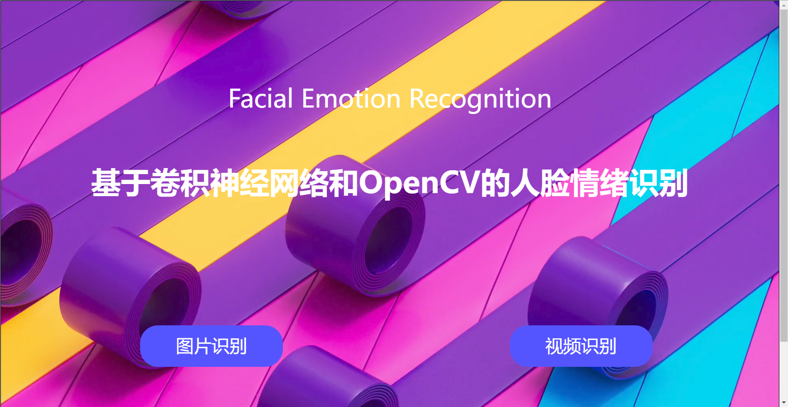
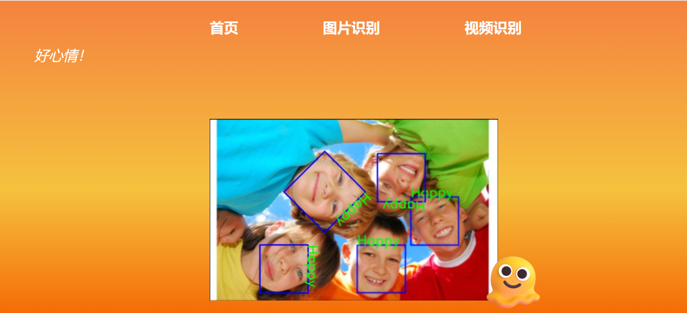
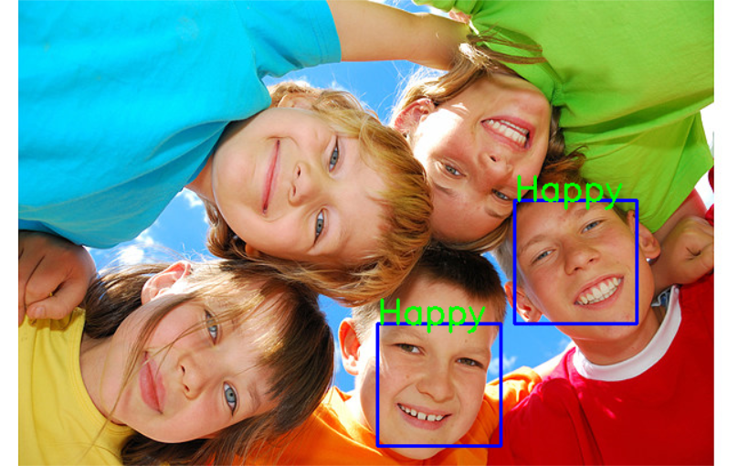
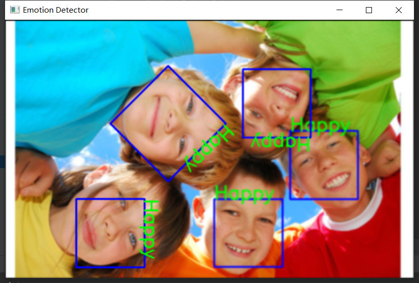

# 情绪识别

对图片/摄像头中检测到的人脸进行情绪识别，包括 生气、恐惧、开心、平静、难过、惊讶 六种情绪。

#### 开发环境

+ Python 3.8.10
+ OpenCV 4.6.0
+ dlib 19.24.0
+ face_recognition 1.3.0
+ keras 2.9.0
+ tensorflow 2.9.1

#### 模型

###### 人脸识别

+ 图片检测：使用Python模块[face_recognition](https://github.com/ageitgey/face_recognition)进行*人脸定位* 和 *人脸相似度对比*
+ 摄像头实时检测：使用OpenCV的人脸特征分类器haarcascade_frontalface_alt2.xml

###### 情绪识别

+ dataset: 使用kaggle的[fer2013](https://www.kaggle.com/c/challenges-in-representation-learning-facial-expression-recognition-challenge/data)数据集；
+ 网络搭建：用keras实现一个序贯模型；

#### 前端页面

###### 首页

###### 图片识别页面

用法：

+ 点击左侧文字提示，选择一张本地图片；
+ 点击右侧文字提示，进行表情识别，跳转到 *识别结果页面*。

其他：下方情绪贴纸可进行鼠标互动，导航栏可进行页面跳转。

###### 识别结果页面

###### 视频识别页面

用法：

+ 画框内会实时显示网络摄像头的内容，并进行人脸表情识别。

#### 问题 & 解决方案

###### 人脸检测的旋转处理

+ 问题1：使用OpenCV的haar人脸特征分类器和face_recognition模块时，均出现无法检测到有一定倾斜角度的人脸的问题，如下图。
  
  + 解决方案：每次将图片旋转45度，在新的角度下检测人脸并进行标注
+ 问题2：直接旋转图片可能导致图片边缘被裁剪
  + 解决方案：根据旋转的角度，计算画布所需的宽高，将旋转后图像平移到画布中心，修改旋转矩阵的参数，封装成Util下的`rotate_bound(image, src_h, src_w, angle, i)`方法；
+ 问题3：在相近的角度下，同一个人可能被重复识别并标注
  + 解决方案：将新检测到的人脸与已经标注的人脸进行对比，使用face_recognition下的`face_compare`方法，舍弃过于相似的人脸；
  + 结果：
  
+ 问题4：在不同大小、分辨率的显示器上，页面可能会出现错位的现象。
  + 解决方案：将各网页原有css文件修改，采用自适应式布局；
###### 格式问题

+ 问题：在处理数据集分离训练集和测试集的时候，分离后输出数据的时候出现了多行重复数据
  + 解决方案：仔细检查之后发现是格式错误，python对缩进具有严格的要求，稍微一不留神就会发生unindent does not match any outer，而这里的问题正是print输出语句没有顶格写，被当成循环代码中的语句，导致输出了多行重复数据。

#### 参考

1. [Rotate images (correctly) with OpenCV and Python - PyImageSearch](https://pyimagesearch.com/2017/01/02/rotate-images-correctly-with-opencv-and-python/)
2. 
